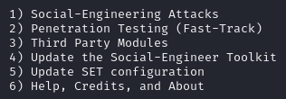
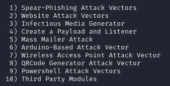
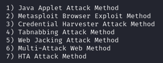
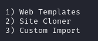
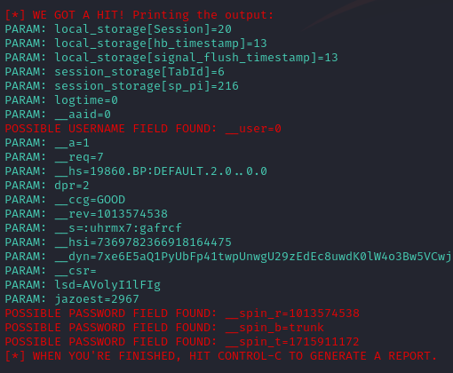

# (Phsihing) Clonando sites com setoolkit

O SET é um framework de pentest feito para realizar engenharia social, e nessa atividade, será utilizada essa função da ferramenta. (1)

E dentre as opções de ataques de engenharia social, nessa atividade será utilizado o de clone de websites. (2)

Por fim, o método de ataque de engenharia social será com roubo de credenciais. (3)

Desse modo, será clonado o site do facebook, e quando o usuário tentar se conectar utilizando o site falso, seus dados serão vazados para o servidor hospedeiro do clone. (2)

